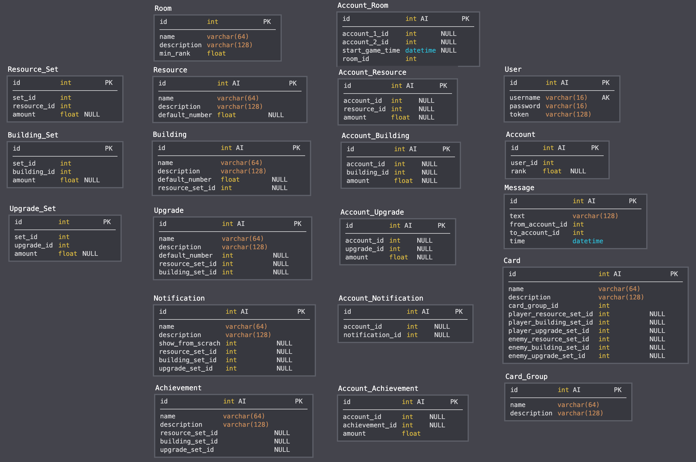
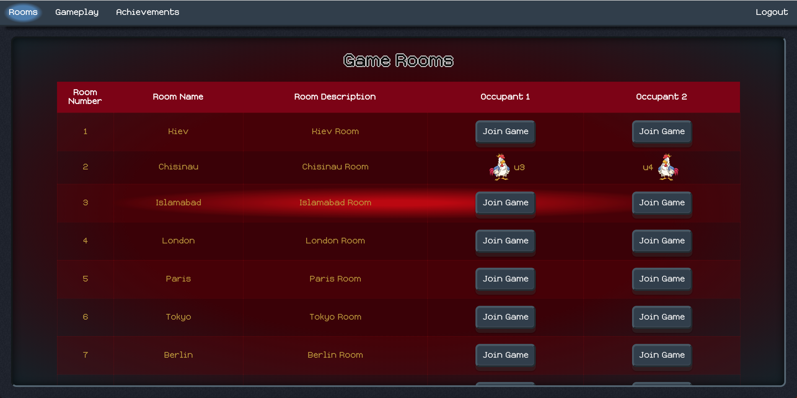
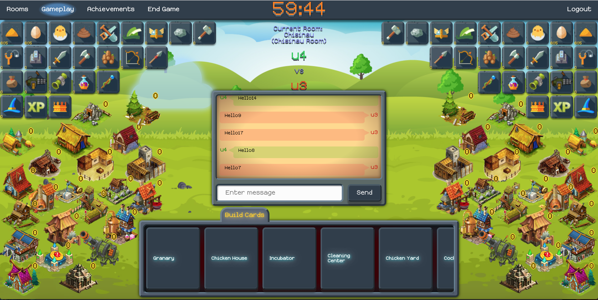
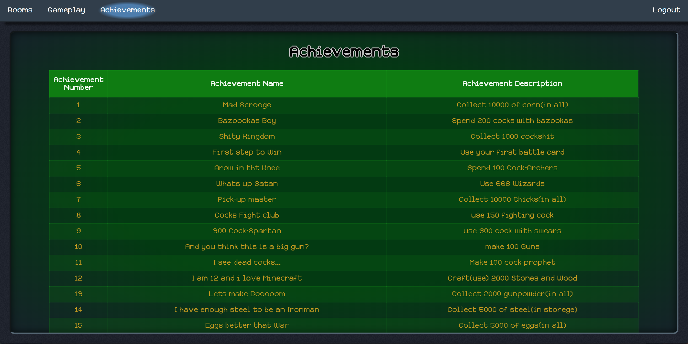

# Strategy Card Game Project

[Ссылка на Схему базы данных](https://app.sqldbm.com/MySQL/Edit/p43934/)

[Ссылка на статические данные для наполнения таблиц в нашей базе данных](https://docs.google.com/spreadsheets/d/1BEA-_cTu4PggzN32PsvMAReF-o24hz7FQkcQkyPnmEI/edit#gid=567549390)

[Ссылка на Project Management app](https://trello.com/b/ogkPLt2D/strategy-card-game)

[Ссылка на Project CI(Continues Integration)](https://travis-ci.com/rubfan/strategy-card-game/)

[Ссылка на Project Cloud](https://devcenter.heroku.com/categories/reference)

# FE Технологии:
---------------------
- [JavaScript](https://www.w3schools.com/jS/default.asp)
- [Ajax](https://www.w3schools.com/jS/js_ajax_intro.asp)
- [Json](https://www.w3schools.com/js/js_json_intro.asp)
- [HTML](https://www.w3schools.com/html/default.asp)
- [CSS](https://www.w3schools.com/css/default.asp)

## FE Файлы и папки скелета приложения: 
---------------------
- [/src/main/resources/webapp/*.html](/src/main/resources/webapp/) - все HTML файлы разметки отображения для отрисовки View (нашего MVC приложения)
- [/src/main/resources/webapp/css/*.css](/src/main/resources/webapp/css/)  - все CSS файлы стилизации отображения (расположение, размеры, цвета, толщина, отступы, закругления и т.д.)
- [/src/main/resources/webapp/font/*.ttf](/src/main/resources/webapp/font/) - файлы шрифтов
- [/src/main/resources/webapp/images/*.png, *.jpg, *.svg](/src/main/resources/webapp/images/) - картинки для наполнения HTML страниц и CSS стилей
- [/src/main/resources/webapp/javascript/*.js](/src/main/resources/webapp/javascript/) - все Front End скритпы (или программы), наиважнейший из них `routing.js` который позволяет делать AJAX http запросы на наш Java Back End на написанные нами эндпоинты запуская замапленные на них методы в Controllers классах.
- [/src/main/resources/webapp/music/*.mp3](/src/main/resources/webapp/music/) - файлы фоновой музыки
- [/src/main/resources/webapp/sounds/*.mp3](/src/main/resources/webapp/sounds/) - файлы разных звуковых эфектов(например звук нажатия кнопки)

## Обмен данными между BE <-> FE: REST HTTP verbs mapped to CRUD


# BE Технологии:
---------------------
- [Maven](https://maven.apache.org/)
- [JUnit](https://junit.org/junit4/)
- [Hamcrest](http://hamcrest.org/JavaHamcrest/)
- [OkHttp](http://square.github.io/okhttp/)
- [MySql](https://www.mysql.com/)
- [h2](https://www.tutorialspoint.com/h2_database/index.htm)
- [JDBC](https://docs.oracle.com/javase/tutorial/jdbc/basics/index.html)
- [SQL](https://www.w3schools.com/sql/)
- [REST](https://www.codecademy.com/articles/what-is-rest)
- [Jetty (Web server and javax.servlet container)](https://www.eclipse.org/jetty/)
- [Jersey (JAX-RS)](https://jersey.github.io/)

## Using Design Patterns
- [Enterprise патерны](https://martinfowler.com/articles/enterprisePatterns.html)
- [J2EE патерны](https://stackabuse.com/java-j2ee-design-patterns)
- [Web патерны](http://www.corej2eepatterns.com/DataAccessObject.htm)
- [Патерны](http://design-pattern.ru/index.html)
- [Chain of responsibility](https://ru.wikipedia.org/wiki/%D0%A6%D0%B5%D0%BF%D0%BE%D1%87%D0%BA%D0%B0_%D0%BE%D0%B1%D1%8F%D0%B7%D0%B0%D0%BD%D0%BD%D0%BE%D1%81%D1%82%D0%B5%D0%B9)
- [DTO](https://ru.wikipedia.org/wiki/DTO)
- [DAO](https://ru.wikipedia.org/wiki/Data_Access_Object)
- [MVC](https://ru.wikipedia.org/wiki/Model-View-Controller)
- [ORM](https://ru.wikipedia.org/wiki/ORM)
- [JPA](https://ru.wikipedia.org/wiki/Java_Persistence_API)
- [POJO](https://ru.wikipedia.org/wiki/POJO)

## BE Application Design:


## BE Файлы и папки скелета приложения: 
---------------------
- [/src/main/java/ua/od/game/controller](/src/main/java/ua/od/game/controller) - контроллеры содержщие эндпоинт методы которые вызываются в зависимости от того какой пришел HTTP запрос на Jetty сервер 
- [/src/main/java/ua/od/game/dto](/src/main/java/ua/od/game/dto) - классы обертки данных, служат для обмена данными между слоем контроллеров и сервисов 
- [/src/main/java/ua/od/game/service](/src/main/java/ua/od/game/service) - классы содержащие бизнес логику приложения
- [/src/main/java/ua/od/game/model](/src/main/java/ua/od/game/model) - классы обертки данных, служат для обмена данными между слоем сервисов и слоем DAO классов
- [/src/main/java/ua/od/game/repository/dao](/src/main/java/ua/od/game/repository/dao) - DAO классы в которых находятся методы содержащие SQL CRUD операции для взаимодействия с сущностями реляционных баз данных и превращения их в Entity Java обьекты, или другими словами классы которые занимаются ORM задачами
- [/src/main/java/ua/od/game/config/AppContextConfig.java](/src/main/java/ua/od/game/config/AppContextConfig.java) - настройки контекста приложения(!!!тут вручную надо регистрировать новые классы проекта!!!)
- [/src/main/java/ua/od/game/config/DataBaseConfig.java](/src/main/java/ua/od/game/config/DataBaseConfig.java) - загрузка `db.properties` файла с конфигурациями базы данных при старте проекта для доступа из Java
- [/src/main/java/ua/od/game/ApplicationStarter.java](/src/main/java/ua/od/game/ApplicationStarter.java) - загрузка всех конфигураций и запуск Jetty сервера
- [/src/main/java/ua/od/game/DataBaseDeployer.java](/src/main/java/ua/od/game/DataBaseDeployer.java) - развертывание базы данных согласно SQL скриптам собранным в папке `/src/main/resources/db/*.sql`
- [/src/main/java/ua/od/game/repository/helper/SqlHelper.java](/src/main/java/ua/od/game/repository/helper/SqlHelper.java) - обычный класс помощник который упрощает работу с JDBC
- [/src/main/resources/config/db.properties](/src/main/resources/config/db.properties) - тут находятся все конфигурации которые позволяют работать с базой данных
- [/src/main/resources/db/*.sql](/src/main/resources/db/) - тут находятся все SQL скрипты которые позволяют развернуть базу данных и заполнить ее начальными статичными данными

- [/src/test/java/ua/od/game/repository/dao/DbTest.java](/src/test/java/ua/od/game/repository/dao/DbTest.java) - super класс всех тестов связанных с базой данных - автоматически разворачивает h2 базу используя настройки из файла `/src/test/resources/config/db.properties` и файлы SQL скриптов из папки `/src/test/resources/db/*.sql`
- [/src/test/resources/config/db.properties](/src/test/resources/config/db.properties) - тут находятся все конфигурации которые позволяют работать с базой данных на этапе тестирования
- [/src/test/resources/db/*.sql](/src/test/resources/db/) - тут находятся все SQL скрипты которые позволяют развернуть базу данных и заполнить ее данными для тестов

# Краткая справка по таблицам
============================


`User` - таблица в которой сохранены все зарегистрированые в игре пользователи

`Room` - таблица в которой хранятся все комнаты.

`Account_Room` - таблица в которой хранятся айди комнат и айди двух аккаунтов чтобы обьединять пары игроков для проведения игр.

`Message` - таблица в которой хранятся все сообщения которые создаются игроками в чате

`Building` - таблица в которой хранится статическая информация о здании - название и описание (билдинги позволяют производить ресурсы - больше билдингов больше ресурсов)

`Account_Building` - таблица котороя отображает сколько билдингов пользователь уже нажил в течении одной игры, обнуляется на старте игры

`Resource` - таблица в которой хранится статическая информация о ресурсе - название и описание (ресурсы это основные элементы количество которых надо накапливаь в игре)

`Account_Resource` - отображает сколько пользователь заработал в текущей игре ресурсов - таблица постоянно обновляется так как здания потребляют и производят ресурсы каждую минуту динамически, обнуляется на старте игры

`Upgrade` - таблица в которой хранится статическая информация об апгрейде - название и описание (апгрейды улучшают производство зданий на N процентов)

`Account_Upgrade` - отображает какие апргрейды игрок приобрел в течении игры - эти апгрейды в свою очередь влияют на количество ресурсов произведенных зданиями в зависимости от указаных процентов, обнуляется на старте игры

`Achievement` - таблица в которой хранится статическая информация о ачивменте - название и описание (просто награды типа звезд и медалей за достижения)

`Account_Achievement` - отображает все достижения сделаные пользователем за все игры которые он когда либо сиграл - нужна для показания успеха игрока и сравнения с успехами других в одной теблице в фигишном UI на фронтенде, таблица обнуляется только когда создается новый пользователь

`Notification` - таблица в которой хранится статическая информация о нотификейшене - название и описание (нужна для придания игре динамики по смыслу тоже самое что и ачивменты)

`Account_Notification` - отображает все возможные сообщения в игре - нужны для отображения прогресса игрока когда он достиг определеного количества задний, ресурсов или апгрейдов

`Card` - таблица в которой хранится статическая информация о картах - название и описание (основная еденица управления процессом игры)

`Card_Group` - таблица в которой хранится список групп на которые деляться карты. Например некоторые возможные названия групп: 'Покупка зданий', 'Покупка ресурсов', 'Атакова противника', 'Апгрейд зданий'

`Resource_Set` - наборы ресурсов обьедененых одним айдишником set_id (этот айдишник одинаковый у всех кто в наборе)
`Building_Set` - наборы зданий обьедененых одним айдишником set_id (этот айдишник одинаковый у всех кто в наборе)
`Upgrade_Set` - наборы апгрейдов обьедененых одним айдишником set_id (этот айдишник одинаковый у всех кто в наборе)

# Краткое описание проекта:
=========================== 
```
Упрощенная RTS игра в которую можно играть вдвоем по сети. 

Остовные правила:

Используя карты нужно достичь максимального показателя определенного ресурса(например Власти) или добиться нулевого показателя этого ресурса у противника.

Карты являются единственной возможностью управлять процессом игры и они могут влиять(плюсовать и минусовать) на "Ресурсы" "Здания" и "Апгрейды" собственные и противника.

Чтобы сделать любой экшен(действие) в игре например: купить здание, проапгрейдить здание, пополнить ресурс, нанести удар по зданиям апгрейдам или ресурсам противника, обменять один ресурс на другой и т.д. нужно применять доступные карты.

Эти или какие либо иные придуманые экшены будут реализовываться по средствам описания действия той или иной карты. 

Применение карты выражается в плюсовании или минусовании набраных Ресурсов Зданий и Апгрейдов в таблицах - Account_Building, Account_Resource, Account_Upgrade.

В списке карт каждая карта может появиться тогда когда для нее есть все ее требуемые "Ресурсы" "Здания" и "Апгрейды".

После использования карты мы создаем запрос в REST API нашего серверсайда и вычитаем все расходники из таблиц:

Account_Building, Account_Resource, Account_Upgrade, для себя и для противника.
```

# Описание игры:
=========================== 
```
Игра состоит из 4-х html страниц(с которых будут делаться все наши запросы в наш REST сервис с использованием JavaScript+Ajax+Json):
```
Станица Login-а или Create new User.

```
Страница списка всех доступных игровых комнат (Room-ов) в которых можно играть, каждый элемент списка состоит из "номер комнаты", "названия комнаты", "количесво игроков в комнате". и кнопки:
"Join Room" - если в выбраной комнате есть один игрок то сразу начать игру, если вы в комнате один то занять место в ожидании когда прийдет другой игрок и стартанет игру.
```

```

Страница где и происходит сам бой между игроками куда мы попадаем после старта игры. Состоит из следующих компонентов:

- "Список Построеных Зданий" (table Building and Account_Building)

- "Список Полученых Ресурсов" (table Resource and Account_Resource)

- "Список Полученых Апгрейдов" (table Upgrade and Account_Upgrade)

- "Список Построеных Зданий Противника" (table Building and Account_Building)

- "Список Полученых Ресурсов Противника" (table Resource and Account_Resource)

- "Список полученых Апгрейдов Противника" (table Upgrade and Account_Upgrade)

- "Список Карт текущего игрока(список карт противника не показываем)" (table Сard and CardGroup)
```

```
Страница достижений. Таблица в которой отображаются все Ачивки набраные в играх всех игроков упорядоченая по убыванию достижений. (edited)
```



